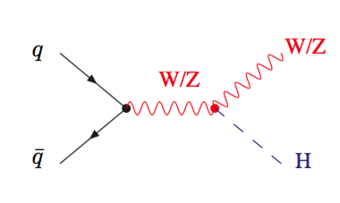
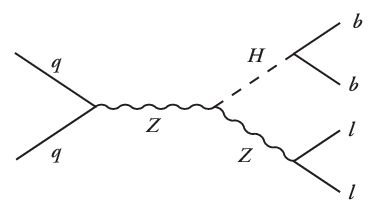
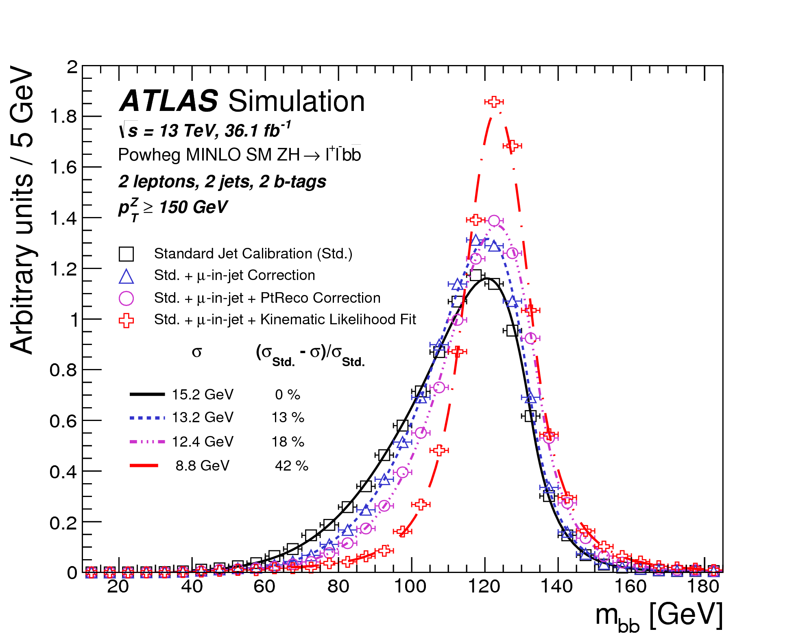

## Introduction

To introduce the modules throughout the week, you will be creating a small,
simple stand-alone analysis before the workshop.  This will serve as a payload for learning
the computing concepts throughout the week and you will be extending and modifying it (You
will even be modifying the code of others!).using a provided piece of code to loop over
events in an AOD-ROOT file. You will then adapt this code to produce some histograms and add
some event selection. The idea is to use this analysis as a 'payload' which you can adapt
throughout the week and add what you learn each day of the bootcamp.

> ## This is Not a Working ATLAS Analysis
>
> The point of this analysis "payload" is to provide a context in which to exercise and
> explore keep computing concepts.  Please appreciate that what you are going to develop
> here should **NOT** be used to perform a full-fledged analysis within ATLAS.  Although
> in principle it *could* be used for this, there are well-established frameworks (e.g. EventLoop) that
> include functionality that you will eventually desire.  They have been developed to
> work efficiently to let you focus on the physics.
>
> With this in mind, have fun using this to think about physics during the bootcamp, but
> when you and your supervisor embark on a "real analysis", follow the guidance about
> the best practices found in the [ATLAS Software Tutorial](https://twiki.cern.ch/twiki/bin/view/AtlasComputing/SoftwareTutorial).
>
{: .callout}

## The Physics : Standard Model VH

No discussion of the LHC would be complete without recalling that the Higgs boson was
[discovered on 4 July 2012](https://arxiv.org/abs/1207.7214), was [awarded the Nobel Prize the year after](https://www.nobelprize.org/prizes/physics/2013/summary/),
and understanding its properties currently composes a [large portion of physics program of ATLAS](https://twiki.cern.ch/twiki/bin/view/AtlasProtected/HiggsWorkingGroup).
The Higgs decaying to b-quarks has the largest branching fraction of 58% and is a direct probe
of Higgs boson-to-quark interactions. Although there are many ways to probe this decay mechanism, one of the most common
is with the [VH production](https://arxiv.org/abs/1808.08238) process.

With this mechanism, it is possible to exploit leptonic
decays of the vector boson for an easy trigger that allows you to have acceptance to lower values of transverse momentum while
also reducing the large multijet production background.  Now, the vector boson that is produced in
association with the Higgs can be either a W or Z boson, and subsequently decay in any of the leptonic channels
and for the purposes of this bootcamp, we will be focusing on the channel in which a Z boson decays to
two charged leptons which are either electrons or muons.  This is identified with a Dataset Identifier (DSID) which is
345055.

> ## Why not tau leptons?
>
> Tau leptons are challenging to reconstruct and identify because they often appear like hadronic jets coming from partons.
> As such, we typically focus on the electron and muon decays of particles and use the term "lepton" to refer to either of these.
>
> If you are curious to know more about why tau leptons are challenging, be sure to ask!
>
{: .callout}

## The Money Plot : m(jj)

The challenge of this search is in reconstructing the decay of the Higgs to a pair of b-quarks, which appear in the
detector as hadronic jets ([0712.2447](https://arxiv.org/abs/0712.2447)).  However, if you can correctly identify
the two jets which originate from the Higgs decay, then you can invoke four-momentum conservation and reconstruct
the invariant mass of that decay.  Now, because we will be searching for thus bump to appear above a background,
the goal is to make this bump as sharply peaked as possible.  Shown here are the many corrections that are applied
to calibrate the data to achieve this goal.

Therefore, throughout this bootcamp, this is the primary observable that we will be exploring : **the invariant mass of a pair of hadronic jets**.

> ## Selections and Corrections
>
> During this bootcamp, not necessarily during this pre-workshop period, we will be exploring the following selections/corrections.
> All of these are motivated by the underlying physics or by an experimental effect of the detector.
> - Fiducial Selections ([Section 3.1](https://arxiv.org/abs/1808.08238)) : Our detector is only sensitive to signals that are produced centrally, where the tracking detector and calorimeters exist, and to signal above some energy threshold which appear above the experimental noise.  We will need to perform selections to use only jets within this "fiducial region".
> - B-Jet Tagging ([1512.01094](https://arxiv.org/abs/1512.01094)) : The Higgs boson decays to two b-quarks which have a very unique characteristic of containing a long-lived particle called a B-hadron.  This is exploited in the process of b-tagging and can help to select the "correct two" jets in the event.
> - Jet Energy Scale Calibration ([1406.0076](https://arxiv.org/abs/1406.0076)) : When a particle goes into the detector, we only see a fraction of its energy.  Therefore, we apply an empirical "fudge factor" called the jet energy scale (JES) to improve the resolution of our measurement.
>
> In case it was not clear **the latter two of these selections/corrections will be explored during the course of the workshop**.  For
> the pre-workshop activity here, you will be guided to explore only the first of these.
>
{: .challenge}



