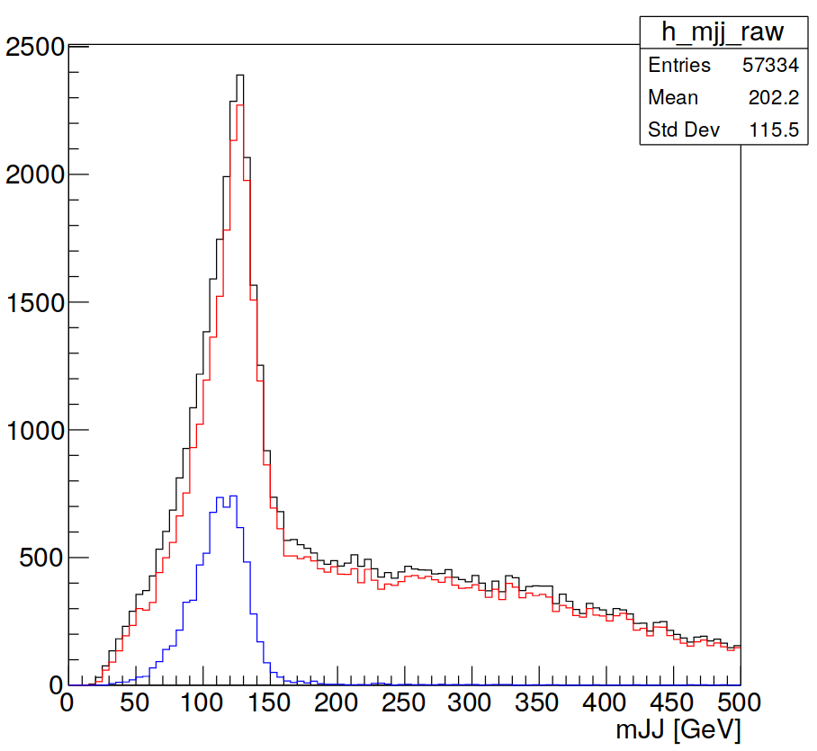

## Make CMakeLists.txt File

Alternatively to the compiling and linking section on the previous page, we can use CMake and GNU Make to generate/run MakeFiles and compile our code for us. 

Now after starting up your docker container you can use the `release_setup.sh` script

~~~bash
docker run --rm -it -v $PWD:/home/atlas/Bootcamp atlas/analysisbase:21.2.75 bash
source release_setup.sh
cd Bootcamp
~~~

Create a separate directory within `Bootcamp` and move `PayloadAnalysis.cxx` into it 

~~~bash
mkdir WorkingDir
mv PayloadAnalysis.cxx WorkingDir/.
~~~

Within the `WorkingDir` directory make a file called `CMakeLists.txt` and add the following to it

~~~CMake
cmake_minimum_required(VERSION 3.4 FATAL_ERROR)

project(AnalysisPayload)

find_package(ROOT)
find_package(AnalysisBase)

message(${ROOT_CXX_FLAGS})

add_executable(AnalysisPayload AnalysisPayload.cxx)

target_compile_definitions(AnalysisPayload
  PRIVATE ${ROOT_DEFINITIONS}
)

target_include_directories(AnalysisPayload
  PRIVATE ${ROOT_INCLUDE_DIRS}
)

target_link_libraries(AnalysisPayload
  PRIVATE ${ROOT_LIBRARIES}
  AnalysisBase::xAODEventInfo
  AnalysisBase::xAODRootAccess
  AnalysisBase::xAODJet
)
~~~

Following this you can go up one directory and make a build directory

~~~bash
cd ..
mkdir build
cd build
~~~

Your directory structure should now look a little something like this

Now it is time to let CMake and GNU Make do things for us

~~~bash
cmake ../WorkingDir/
make
~~~

It was that simple! You should now be able to move back to the `Bootcamp` directory and run your executable that has now been created in the `build` directory

~~~bash
cd ..
./build/AnalysisPayload
~~~
 
And hopefully you should get the same results as before with a small percentage of the hassle. You will learn more about each line of the `CMakeLists.txt` file is doing.

## Plot Jet Properties

As an exercise it might be worth plotting some histograms of some jet variables from the DxAOD file. The idea would be to watch these histograms change as you we include selection or calibration tools throughout the week using what we have learnt. 

> ## Exercise
>
> Similar to how you would in an analysis, fill histograms of 
> * the number of jets in the event
> * and the invariant mass of the two leading jets
> and then save the output. 
>
> > ## Hint 
> > 
> > * You will need to include a ([TH1 class](https://root.cern.ch/doc/master/classTH1D.html)) from ROOT 
> > * At this level you should be familiar with combining 4-momentum to calculate the invariant mass of the di-jet system
> > 
> {: .prereq}
>
> The invariant mass plot you will be producing should look something like this
> 
> 
> 
> You are not meant to struggle with this exercise but a sample solution is included below. However please try your best to complete the exercise before attending the workshop.
>
> > ## Solution
> > 
> > ~~~cpp
> > // stdlib functionality
> > #include <iostream>
> > // ROOT functionality
> > #include <TFile.h>
> > #include <TH1D.h>
> > // ATLAS EDM functionality
> > #include "xAODRootAccess/Init.h"
> > #include "xAODRootAccess/TEvent.h"
> > #include "xAODEventInfo/EventInfo.h"
> > #include "xAODJet/JetContainer.h"
> > 
> > int main() {
> > 
> >   // initialize the xAOD EDM
> >   xAOD::Init();
> > 
> >   // open the input file
> >   TString inputFilePath = "/home/atlas/Bootcamp/Data/mc16_13TeV.345055.PowhegPythia8EvtGen_NNPDF3_AZNLO_ZH125J_MINLO_llbb_VpT.deriv.DAOD_EXOT27.e5706_s3126_r10724_p3840/DAOD_EXOT27.17882744._000026.pool.root.1";
> >   xAOD::TEvent event;
> >   std::unique_ptr< TFile > iFile ( TFile::Open(inputFilePath, "READ") );
> >   event.readFrom( iFile.get() );
> > 
> >   // make histograms for storage
> >   TH1D *h_njets_raw = new TH1D("h_njets_raw","",20,0,20);
> > 
> >   TH1D *h_mjj_raw = new TH1D("h_mjj_raw","",100,0,500);
> > 
> >   // for counting events
> >   unsigned count = 0;
> > 
> >   // get the number of events in the file to loop over
> >   const Long64_t numEntries = event.getEntries();
> > 
> >   // primary event loop
> >   for ( Long64_t i=0; i<numEntries; ++i ) {
> > 
> >     // Load the event
> >     event.getEntry( i );
> > 
> >     // Load xAOD::EventInfo and print the event info
> >     const xAOD::EventInfo * ei = nullptr;
> >     event.retrieve( ei, "EventInfo" );
> >     std::cout << "Processing run # " << ei->runNumber() << ", event # " << ei->eventNumber() << std::endl;
> > 
> >     // retrieve the jet container from the event store
> >     const xAOD::JetContainer* jets = nullptr;
> >     event.retrieve(jets, "AntiKt4EMTopoJets");
> > 
> >     // make temporary vector of jets for those which pass selection
> >     std::vector<xAOD::Jet> jets_raw;
> > 
> >     // loop through all of the jets and make selections with the helper
> >     for(const xAOD::Jet* jet : *jets) {
> >       // print the kinematics of each jet in the event
> >       std::cout << "Jet : " << jet->pt() << jet->eta() << jet->phi() << jet->m() << std::endl;
> > 
> >       jets_raw.push_back(*jet);
> > 
> >     }
> > 
> >     // fill the analysis histograms accordingly
> >     h_njets_raw->Fill( jets_raw.size() );
> > 
> >     if( jets_raw.size()>=2 ){
> >       h_mjj_raw->Fill( (jets_raw.at(0).p4()+jets_raw.at(1).p4()).M()/1000. );
> >     }
> > 
> >     // counter for the number of events analyzed thus far
> >     count += 1;
> >   }
> > 
> >   // open TFile to store the analysis histogram output
> >   TFile *fout = new TFile("myOutputFile.root","RECREATE");
> > 
> >   h_njets_raw->Write();
> > 
> >   h_mjj_raw->Write();
> > 
> >   fout->Close();
> > 
> >   // exit from the main function cleanly
> >   return 0;
> > }
> > ~~~ 
> >
> {: .solution}
{: .challenge} 



