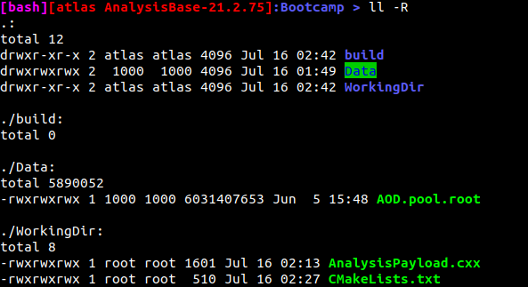

As we saw in the previous section, building our analysis code to work with the ATLAS release **is** possible
when starting from nothing more than `g++` and using flags judiciously.  However, executing this same
command over and over will become very tedious.  You could perhaps put it in a file called `build.sh`
but you will soon find that extending your code to use other functionality is challenging and tedious.
You could use a [makefile](https://opensource.com/article/18/8/what-how-makefile) that you write manually
but this too would become tedious.

To circumvent both of these approaches, ATLAS uses the [CMake](https://cmake.org/) tool to generate makefiles
itself and then perform the build using these makefiles.  More details will be taught on Tuesday
of the bootcamp.  For now, the main point is that this will require that you reorganize your code a bit
and also create a configuration called a `CMakeLists.txt` file.

## Reorganize
In the previous example, the `AnalysisPayload` was built in the same directory as where the
`AnalysisPayload.cxx` source code lived.  When using CMake, we will follow a different organizational
paradigm.  Now, you will be dividing your work into two "areas". The first,
your `source` directory, is where your source code lives.  The second, your `build` directory,
is where you will use CMake to perform the build and where you executables will appear.

If you haven't already, you might as well delete the `AnalysisPayload` that you created before.
You will be creating it again now.  Then, start by creating a separate directory within `Bootcamp`
called `source` and move `AnalysisPayload.cxx` into it

~~~bash
cd Bootcamp
mkdir source
mv AnalysisPayload.cxx source/.
~~~

Now create a `build` directory that is at the same level as `source`

~~~bash
cd Bootcamp
mkdir build
~~~

You will do nothing within this directory yet, but it will function as you "staging area" later.  Now
Your directory structure is ready to insert the CMake configuration file.

## Make CMakeLists.txt File

At the heart of using CMake is the `CMakeLists.txt` file.  It lives with the code that it
builds and contains information about dependencies and diretory structures.  To use it in
this limited scope, within the `source` directory make a file called `CMakeLists.txt` and
add the following to it

~~~CMake
cmake_minimum_required(VERSION 3.4 FATAL_ERROR)

project(AnalysisPayload)

find_package(ROOT)
find_package(AnalysisBase)

message(${ROOT_CXX_FLAGS})

add_executable(AnalysisPayload AnalysisPayload.cxx)

target_compile_definitions(AnalysisPayload
  PRIVATE ${ROOT_DEFINITIONS}
)

target_include_directories(AnalysisPayload
  PRIVATE ${ROOT_INCLUDE_DIRS}
)

target_link_libraries(AnalysisPayload
  PRIVATE ${ROOT_LIBRARIES}
  AnalysisBase::xAODEventInfo
  AnalysisBase::xAODRootAccess
  AnalysisBase::xAODJet
)
~~~

That's it, now let's use it!

## Building with CMake

To use this new setup, boot up the image as before and setup the release using the `release_setup.sh` script.

~~~bash
docker run --rm -it -v $PWD:/home/atlas/Bootcamp atlas/analysisbase:21.2.75 bash
source release_setup.sh
~~~

Your directory structure should now look a little something like this

Now it is time to let CMake and GNU Make do things for us.  This is carried out within the `build` directory.

~~~bash
cd build
cmake ../source/
~~~

> [bash][atlas AnalysisBase-21.2.75]:build > cmake ../source/
>
> -- The C compiler identification is GNU 6.2.0
>
> -- The CXX compiler identification is GNU 6.2.0
>
> -- Check for working C compiler: /opt/lcg/gcc/6.2.0binutils/x86_64-slc6/bin/gcc
>
> -- Check for working C compiler: /opt/lcg/gcc/6.2.0binutils/x86_64-slc6/bin/gcc -- works
>
> -- Detecting C compiler ABI info
>
> -- Detecting C compiler ABI info - done
>
> -- Detecting C compile features
>
> -- Detecting C compile features - done
>
> -- Check for working CXX compiler: /opt/lcg/gcc/6.2.0binutils/x86_64-slc6/bin/g++
>
> -- Check for working CXX compiler: /opt/lcg/gcc/6.2.0binutils/x86_64-slc6/bin/g++ -- works
>
> -- Detecting CXX compiler ABI info
>
> -- Detecting CXX compiler ABI info - done
>
> -- Detecting CXX compile features
>
> -- Detecting CXX compile features - done
>
> -- Found AnalysisBase: /usr/AnalysisBase/21.2.75/InstallArea/x86_64-slc6-gcc62-opt (version: 21.2.75)
>
> -- Found AnalysisBaseExternals: /usr/AnalysisBaseExternals/21.2.75/InstallArea/x86_64-slc6-gcc62-opt (version: 21.2.75)
>
> -- Setting ATLAS specific build flags
>
> -- checker_gccplugins library not found
>
> -- Package(s) in AnalysisBaseExternals: 20
>
> -- Using the LCG modules without setting up a release
>
> -- Package(s) in AnalysisBase: 174
>
> -- Looking for pthread.h
>
> -- Looking for pthread.h - found
>
> -- Looking for pthread_create
>
> -- Looking for pthread_create - not found
>
> -- Check if compiler accepts -pthread
>
> -- Check if compiler accepts -pthread - yes
>
> -- Found Threads: TRUE
>
>  -pipe -m64 -fsigned-char -pthread -std=c++14
>
> -- Configuring done
> -- Generating done
> -- Build files have been written to: /home/atlas/Bootcamp/build
>
{: .output}

~~~bash
make
~~~

> [bash][atlas AnalysisBase-21.2.75]:build > make
>
> Scanning dependencies of target AnalysisPayload
>
> [ 50%] Building CXX object CMakeFiles/AnalysisPayload.dir/AnalysisPayload.cxx.o
>
> [100%] Linking CXX executable AnalysisPayload
>
> [100%] Built target AnalysisPayload
>
{: .output}

It was that simple! Your `AnalysisPayload` executable should have been created within the `build`
directory and you can execute it as before.

~~~bash
./AnalysisPayload
~~~

Hopefully you get the same results as before with a small percentage of the hassle. You will learn more
about each line of the `CMakeLists.txt` file is doing on Tuesday, though there is a
[tutorial](https://cmake.org/cmake-tutorial/) if you are super eager.  **This is in no way mandatory or recommended!
As long as you got the above to work, you are good-to-go!**



