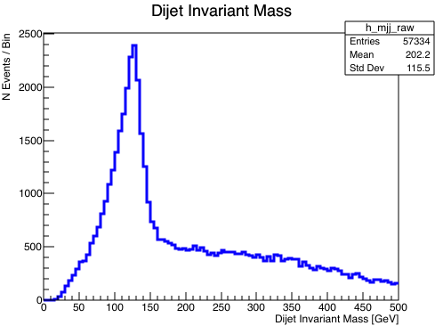
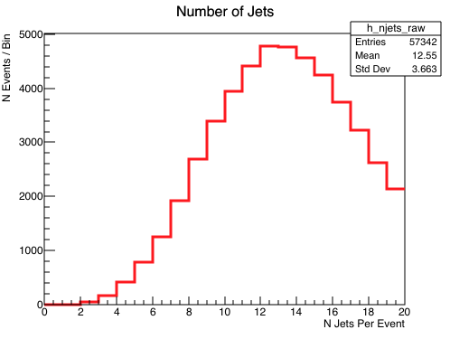

## Plot Jet Properties

As an exercise, before the start of the bootcamp, and as a means by which to get familiar with
the workflow while also thinking about some physics, try to complete the following exercise.
The output of this exercise will be something that will evolve during the bootcamp and will
not be left as a one-and-done exercise now.  So if you are struggling to make these two plots,
**ASK SOMEONE**!

> ## Exercise
>
> Similar to how you would in an analysis, fill histograms of
> * the number of jets in the event
> * and the invariant mass of the two leading jets
> and then save the output.
>
> > ## Hint
> >
> > * You will need to include a ([TH1 class](https://root.cern.ch/doc/master/classTH1D.html)) from ROOT
> > * At this level you should be familiar with combining 4-momentum to calculate the invariant mass of the di-jet system
> >
> {: .prereq}
>
> The invariant mass plot you will be producing should look something like this
>
> 
> 
>
> You are not meant to struggle with this exercise but a sample solution is included below. However please try your best to complete the exercise before attending the workshop.
>
> > ## Solution
> >
> > ~~~cpp
> > // stdlib functionality
> > #include <iostream>
> > // ROOT functionality
> > #include <TFile.h>
> > #include <TH1D.h>
> > // ATLAS EDM functionality
> > #include "xAODRootAccess/Init.h"
> > #include "xAODRootAccess/TEvent.h"
> > #include "xAODEventInfo/EventInfo.h"
> > #include "xAODJet/JetContainer.h"
> >
> > int main() {
> >
> >   // initialize the xAOD EDM
> >   xAOD::Init();
> >
> >   // open the input file
> >   TString inputFilePath = "/home/atlas/Bootcamp/Data/mc16_13TeV.345055.PowhegPythia8EvtGen_NNPDF3_AZNLO_ZH125J_MINLO_llbb_VpT.deriv.DAOD_EXOT27.e5706_s3126_r10724_p3840/DAOD_EXOT27.17882744._000026.pool.root.1";
> >   xAOD::TEvent event;
> >   std::unique_ptr< TFile > iFile ( TFile::Open(inputFilePath, "READ") );
> >   event.readFrom( iFile.get() );
> >
> >   // make histograms for storage
> >   TH1D *h_njets_raw = new TH1D("h_njets_raw","",20,0,20);
> >
> >   TH1D *h_mjj_raw = new TH1D("h_mjj_raw","",100,0,500);
> >
> >   // for counting events
> >   unsigned count = 0;
> >
> >   // get the number of events in the file to loop over
> >   const Long64_t numEntries = event.getEntries();
> >
> >   // primary event loop
> >   for ( Long64_t i=0; i<numEntries; ++i ) {
> >
> >     // Load the event
> >     event.getEntry( i );
> >
> >     // Load xAOD::EventInfo and print the event info
> >     const xAOD::EventInfo * ei = nullptr;
> >     event.retrieve( ei, "EventInfo" );
> >     std::cout << "Processing run # " << ei->runNumber() << ", event # " << ei->eventNumber() << std::endl;
> >
> >     // retrieve the jet container from the event store
> >     const xAOD::JetContainer* jets = nullptr;
> >     event.retrieve(jets, "AntiKt4EMTopoJets");
> >
> >     // make temporary vector of jets for those which pass selection
> >     std::vector<xAOD::Jet> jets_raw;
> >
> >     // loop through all of the jets and make selections with the helper
> >     for(const xAOD::Jet* jet : *jets) {
> >       // print the kinematics of each jet in the event
> >       std::cout << "Jet : " << jet->pt() << jet->eta() << jet->phi() << jet->m() << std::endl;
> >
> >       jets_raw.push_back(*jet);
> >
> >     }
> >
> >     // fill the analysis histograms accordingly
> >     h_njets_raw->Fill( jets_raw.size() );
> >
> >     if( jets_raw.size()>=2 ){
> >       h_mjj_raw->Fill( (jets_raw.at(0).p4()+jets_raw.at(1).p4()).M()/1000. );
> >     }
> >
> >     // counter for the number of events analyzed thus far
> >     count += 1;
> >   }
> >
> >   // open TFile to store the analysis histogram output
> >   TFile *fout = new TFile("myOutputFile.root","RECREATE");
> >
> >   h_njets_raw->Write();
> >
> >   h_mjj_raw->Write();
> >
> >   fout->Close();
> >
> >   // exit from the main function cleanly
> >   return 0;
> > }
> > ~~~
> >
> {: .solution}
{: .challenge}

> ## Hint
>
> If you do not want to just look at the solution, and are struggling, then here are some hints :
> - You will probably need to use these two libraries in [ROOT](https://root.cern.ch/) :
>   - [TH1D](https://root.cern.ch/doc/master/classTH1D.html) : For making histograms. Google if you need examples on how to use this.
>   - [TFile](https://root.cern.ch/doc/master/classTFile.html) : For saving the histograms so you can access/draw them later.
> - Remember you will need to include the header (`#include`) of these libraries, like any external C++ functionality.
> - Don't forget to `TFile::Close` your output file.
>
{: .callout}



